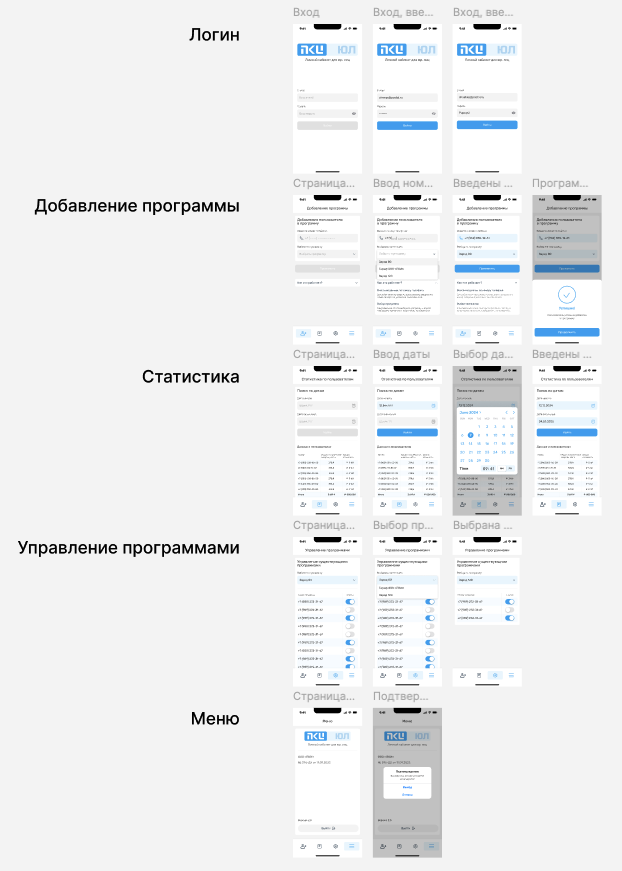

# $$ПКИ\quadЮЛ$$

---

Фронтенд приложения для юридических лиц, направленное на управление программами электрозаправок. Сделаны вставки с командами print и/или чтение готовых json вместо бэкенда.

---

## Дизайн

Макет из 5 страниц в `Figma` был единственным техническим заданием. Он включает в себя 5 страниц, одна из которых вход в аккаунт, остальные - пользовательский интерфейс.

---

## Технологии

Проект был написан с помощью фреймворка Flutter на языке программирования Dart. Библиотеки и версии, использованные во время разработки (вставка из файла `pubspec.yaml`):

	environment:
	  sdk: ^3.8.1
	flutter:
	sdk: flutter
	flutter_localizations:
	sdk: flutter
	mask_text_input_formatter: ^2.4.0
	flutter_svg: ^2.0.7
	dropdown_button2: ^2.3.9
	animations: ^2.0.7
	lottie: ^2.6.0
	intl: ^0.20.2
	syncfusion_flutter_datepicker: ^30.1.42
	cupertino_icons: ^1.0.8
	flutter_lints: ^5.0.0

---

## Разработка

В процессе разработки были затронуты 2 папки, отвечающие за исходный код и хранение неизменяемых файлов проекта. Были затронуты такие директории, как:

---

### assets (Файлы проекта)

	assets
	├── animations
	│   └── checkmark success.json
	├── fonts
	│   ├── Rubik-Light.ttf
	│   ├── Rubik-Medium.ttf
	│   ├── Rubik-Regular.ttf
	│   └── Rubik-SemiBold.ttf
	├── icons
	│   ├── arrow_down.svg
	│   ├── arrow_up.svg
	│   ├── calendar_icon.svg
	│   ├── calendar_icon_blue.svg
	│   ├── exit.svg
	│   ├── eye.svg
	│   ├── eye_with_line.svg
	│   ├── left_arrow.svg
	│   ├── menu_button_add.svg
	│   ├── menu_button_add_selected.svg
	│   ├── menu_button_control.svg
	│   ├── menu_button_control_selected.svg
	│   ├── menu_button_menu.svg
	│   ├── menu_button_menu_selected.svg
	│   ├── menu_button_statistic.svg
	│   ├── menu_button_statistic_selected.svg
	│   ├── phone.svg
	│   ├── phone_blue.svg
	│   ├── pki_ul_logo.svg
	│   ├── pki_ul_logo_menu.svg
	│   └── right_arrow.svg
	└── test_data
	    ├── control_data.json
	    └── statistics.json

Описания папок

`animations` - Lottie анимации\
`fonts` - шрифты семейства `Rubik`\
`icons` - иконки в формате svg\
`test_data` - данные, имитирующие получение ответа от сервера в формате json

---

### lib (Исходный код)

	lib
	├── main.dart
	├── screens
	│   ├── home_page.dart
	│   ├── login.dart
	│   └── pages
	│       ├── add_program.dart
	│       ├── menu.dart
	│       ├── program_control.dart
	│       └── statistics.dart
	├── scripts
	│   ├── formatting.dart
	│   └── json_reader.dart
	└── widgets
	    ├── add_program
	    │   ├── add_program_form.dart
	    │   ├── dialog_add_program.dart
	    │   └── how_it_works.dart
	    ├── global
	    │   ├── app_bar.dart
	    │   ├── bottom_navigation_bar.dart
	    │   └── fields and alerts
	    │       ├── calendar_pop_up.dart
	    │       ├── calendar_time_pop_up.dart
	    │       ├── date_picker_field.dart
	    │       ├── drop_down_button.dart
	    │       ├── email_field.dart
	    │       ├── password_field.dart
	    │       └── phone_input.dart
	    ├── login
	    │   └── login_form.dart
	    ├── menu
	    │   └── menu_show_dialog.dart
	    ├── program_control
	    │   ├── program_control_data_viewer.dart
	    │   ├── program_control_form.dart
	    │   └── program_control_numbers_generator.dart
	    └── statistics
	        ├── statistics_data_viewer.dart
	        ├── statistics_form.dart
	        └── statistics_numbers_generator.dart

`main.dart` - главный файл для запуска приложения\
`screens` - папка для указания, что здесь хранятся главные файлы страниц\
$\quad$	`pages` - файлы для страниц\
`scripts` - файлы скриптов, которые не относятся относятся к определённой странице\
`widgets` - виджеты для всех страниц, а также массивные части страниц\
\
$\quad$ *Файлы для следующих 5 папок разделены логически, разбивая большие структуры страниц, на несколько различных классов*\
\
$\quad$ `add_program` - для страницы добавления программы\
$\quad$ `statistics` - для страницы статистики\
$\quad$ `program_control` - для страницы управления программами\
$\quad$ `menu` - для страницы меню\
$\quad$ `login` - для страницы входа\

\
\
$\quad$ `global` - виджеты для работы во всём проекте, могут быть использованы повторно во всех частях, если потребуется. Являются практически самостоятельными конструкциями.\
$\quad\quad$ `app_bar.dart`, `bottom_navigation_bar.dart` - в простонародии "Header" и "Footer" всего проекта.\
$\quad\quad$ `fields and alerts` - папка, в которой хранятся поля ввода разного вида, а также всплывающие окна для дополнительного ввода или подтверждения действия
